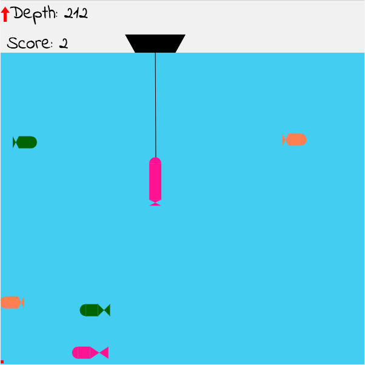

# Funniest Catch
Small game made with ES5 javaScript in prototypal inheritance style

Pure JS and Canvas - no images, no libraries

https://yahorpadlucki.github.io/funniestCatch/

<p align="center">
  
</p>

### Installing
```
npm i
gulp
```